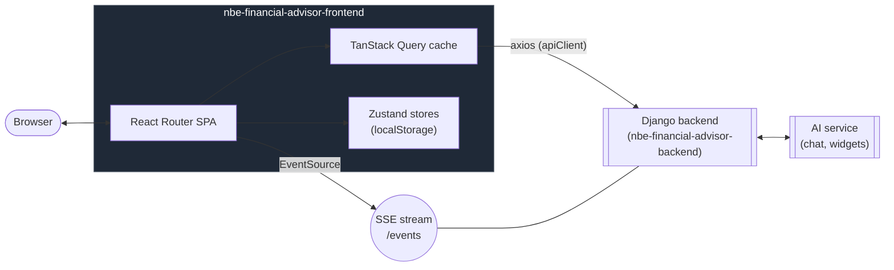
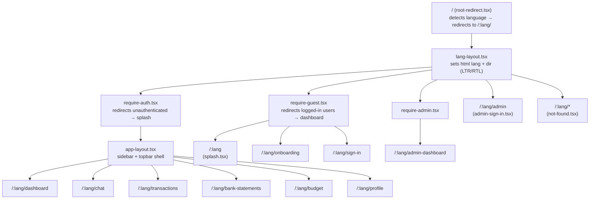
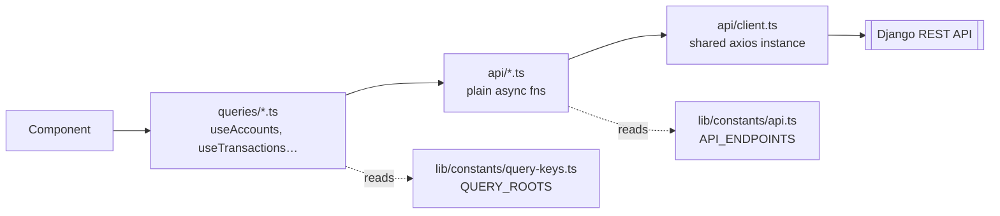
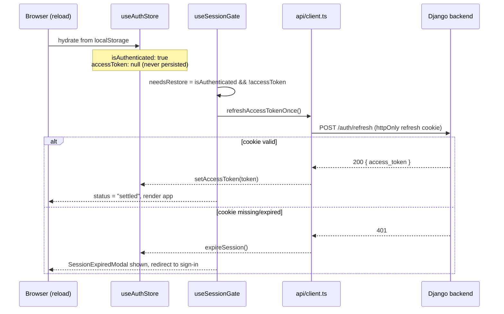
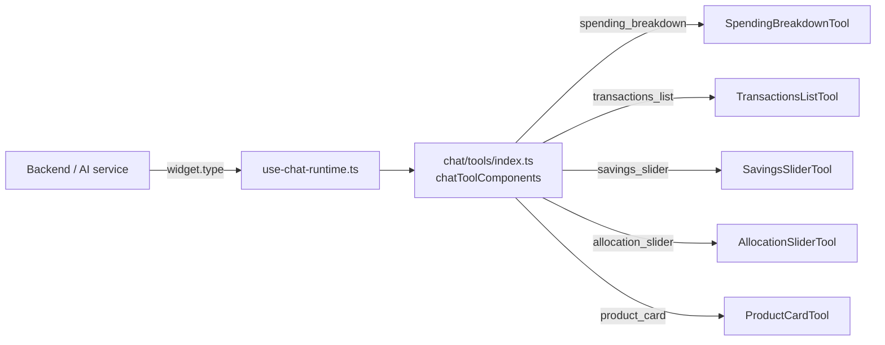

# NBE Financial Advisor — Frontend Documentation

Architecture reference for contributors. This document explains **how the app is put
together and why**; the [README](./README.md) covers running it locally.

> Verified directly against the source tree on 2026-08-19.

## Table of contents

1. [Tech stack](#1-tech-stack)
2. [System context](#2-system-context)
3. [Folder map](#3-folder-map)
4. [Routing](#4-routing)
5. [Data flow (API → Query → Component)](#5-data-flow-api--query--component)
6. [Authentication & session restore](#6-authentication--session-restore)
7. [State management (Zustand stores)](#7-state-management-zustand-stores)
8. [AI chat](#8-ai-chat)
9. [Forms](#9-forms)
10. [Internationalization](#10-internationalization)
11. [Styling rules](#11-styling-rules)
12. [Constants](#12-constants)
13. [Scripts & CI](#13-scripts--ci)
14. ["Where do I edit…?" quick reference](#14-where-do-i-edit-quick-reference)
15. [Known limitations](#15-known-limitations)

---

## 1. Tech stack

| Concern             | Library                         | Notes                                                          |
| ------------------- | ------------------------------- | -------------------------------------------------------------- |
| Routing + framework | React Router v8 (SPA mode)      | `ssr: false` in `react-router.config.ts` — no server rendering |
| UI components       | DaisyUI v5 on Tailwind v4       | Semantic class names only; no raw hex                          |
| Server state        | TanStack Query v5               | All fetched data lives here, never in Zustand                  |
| Client state        | Zustand v5                      | UI prefs, auth flag, chat/onboarding UI state (23 stores)      |
| Forms               | React Hook Form + Zod           | Validation schemas co-located with forms                       |
| i18n                | i18next + react-i18next         | English + Arabic; 19 namespace JSON files each                 |
| HTTP                | axios                           | Single `apiClient` instance; auto-refresh on 401               |
| AI chat             | assistant-ui                    | Streaming threads; tool calls rendered by `chat/tools/`        |
| Icons               | lucide-react                    | All icons from this library; `size-*` + `text-*` classes       |
| Fonts               | Inter (Latin), Tajawal (Arabic) | Loaded via `@fontsource` packages                              |
| Compiler            | React Compiler (babel plugin)   | Wired into `vite.config.ts` via `vite-plugin-babel`            |

## 2. System context



The frontend never talks to the AI service directly — every request, including
chat, goes through the Django backend at `VITE_API_BASE_URL`. There is no
mock/offline mode: the old `mocks/*.ts` + `pickImpl` toggle has been fully
removed, so every environment needs a real backend to run against.

## 3. Folder map

```
app/
├── routes.ts               ← ROUTE REGISTRY: every URL lives here
├── routes/                 ← one file per page or layout guard (21 files)
│
├── api/                    ← real HTTP calls (axios, no React) — 20 files, one per domain
├── queries/                ← TanStack Query hooks (ONLY data layer components import) — 19 files
│
├── types/                  ← TypeScript interfaces + domain-level constants (20 files)
├── store/                  ← Zustand stores, client-only state (23 files)
│
├── lib/
│   ├── constants/          ← named constant files — single source of truth for magic values
│   ├── banks.ts            ← bank codes, names, logos, fuzzy matching
│   ├── format.ts           ← date/time/money/number formatters
│   ├── query-client.ts     ← TanStack Query singleton
│   ├── use-event-stream.ts ← SSE client for live chat/notification events
│   ├── use-session-*.ts    ← auth restore + route-guard gating
│   └── use-*.ts            ← ~35 other custom hooks (not tied to server state)
│
├── components/
│   ├── shared/             ← prop-driven, fetch-free; used by pages AND chat tools
│   │   ├── auth/           ← route guards (RequireAuth, RequireGuest, RestoringScreen)
│   │   ├── forms/          ← BankPicker, DateField, MoneyInput, EntityPicker…
│   │   ├── layout/         ← AppLayout, DataToolbar, Sidebar parts, Pagination…
│   │   ├── modals/         ← BaseModal, ConfirmDialog, SessionExpiredModal…
│   │   ├── preferences/    ← ThemeToggle, LanguageSwitcher, AccessibilityMenu…
│   │   └── skeletons/      ← loading placeholder skeletons
│   ├── auth/               ← ForgotPasswordModal, GoHomeOrSignInLink
│   ├── chat/               ← AI chat UI + tool renderers (chat/tools/, see §8)
│   ├── dashboard/          ← dashboard widgets
│   ├── budget/             ← budget page sections (KPIs, history, insights, charts)
│   ├── transactions/       ← transaction form fields
│   ├── accounts/           ← account card components
│   ├── bank-statements/    ← statement upload + review
│   ├── onboarding/         ← multi-step onboarding step components
│   ├── admin/              ← AdminPanelShell, ProductsPanel, CategoriesPanel,
│   │                          FeedbackPanel, IssuesPanel (super_admin/reviewer only)
│   └── profile/            ← profile page sections
│
├── i18n/
│   ├── index.ts            ← i18next initialization
│   └── locales/
│       ├── en/             ← source of truth (19 namespace JSON files)
│       └── ar/             ← must mirror en/ key-for-key
│
├── root.tsx                ← React Router root (providers, global error boundary)
└── app.css                 ← global styles + DaisyUI/Tailwind theme tokens

scripts/                    ← CI/pre-commit checks (Node scripts + shell)
public/
└── banks/                  ← bank logo PNGs, named exactly by bank code (e.g. NBE.png)
```

## 4. Routing

Registered in `app/routes.ts` using `@react-router/dev/routes` helpers — this
is the single source of truth for every URL in the app:



Three routes live **outside** the `:lang` tree entirely (no locale context is
available when they're opened): `verify-email`, `reset-password` (emailed
links), and `bank-connect/callback` (fixed `redirect_uri` registered with the
bank connector).

All URL segments live in `lib/constants/routes.ts` as `ROUTE_SEGMENTS`; build
links with `localizedPath(lang, ROUTE_SEGMENTS.x)`. Never write a raw URL
string in `routes.ts` or a component.

## 5. Data flow (API → Query → Component)



- **`api/`** — one file per domain (`accounts.ts`, `admin.ts`, `analytics.ts`,
  `anomalies.ts`, `auth.ts`, `bank-connections.ts`, `bank-statements.ts`,
  `budget.ts`, `categories.ts`, `chat.ts`, `consent.ts`, `dashboard.ts`,
  `events.ts`, `feedback.ts`, `goals.ts`, `issues.ts`, `preferences.ts`,
  `profile.ts`, `recurring-charges.ts`, `transactions.ts`). Plain async
  functions, no React. All go through `api/client.ts`.
- **`api/client.ts`** — single axios instance. Reads `VITE_API_BASE_URL`,
  appends a trailing slash automatically (Django requirement), injects
  `Authorization: Bearer <token>` from `useAuthStore.getState()` (not a hook —
  interceptors run outside React), and transparently retries a 401 once after
  a silent refresh (see §6).
- **`queries/`** — the _only_ layer components import. Owns query keys, cache
  invalidation, and success/error toasts. Mutations use
  `useInvalidatingMutation` (`queries/shared.ts`), which runs the mutation,
  invalidates the given query keys, and shows a toast by i18n key.
- Query key **roots** live in `lib/constants/query-keys.ts` as `QUERY_ROOTS` —
  always use these, never a raw string key.

> **Rule:** never import `api/` directly in a component — always go through
> `queries/`.

### Real-time updates: SSE, not polling

Chat and notifications use **Server-Sent Events** (`app/lib/use-event-stream.ts`,
`app/api/events.ts`) with ticket-based auth and reconnect backoff — not
`refetchInterval` polling. Extend the SSE stream for new real-time behavior
rather than reintroducing polling.

## 6. Authentication & session restore

The access token is held **in memory only** (a module variable inside
`use-auth-store.ts`) and is never written to `localStorage` — only the
`isAuthenticated` boolean is persisted, via a `partialize` on the store. This
means a page reload always drops the token even though `isAuthenticated` can
still read `true`. Recovering from that state is what `useSessionRestore` /
`useSessionGate` exist for:



Both the route guards and the axios 401-retry interceptor call the same
`refreshAccessTokenOnce()` single-flight function — the backend blacklists a
refresh token after first use (rotate-on-use), so two independent callers
racing with the same pre-rotation cookie would otherwise cause a spurious
sign-out. This is a deliberate design detail, not an incidental optimization.

## 7. State management (Zustand stores)

Client-only state — **no server data in stores**. All server data lives in
the TanStack Query cache.

| Store                              | Purpose                                                     | Persisted |
| ---------------------------------- | ----------------------------------------------------------- | :-------: |
| `use-auth-store`                   | `isAuthenticated` flag + in-memory access token             | flag only |
| `use-admin-auth-store`             | Same in-memory-token pattern, for the admin panel           | flag only |
| `use-display-preferences-store`    | View mode, density, number/date/time format, balance hidden |    ✅     |
| `use-dashboard-prefs-store`        | Dashboard-specific display preferences                      |    ✅     |
| `use-theme-store`                  | Light / dark / system                                       |    ✅     |
| `use-accessibility-store`          | Font scale, high contrast, reduced motion                   |    ✅     |
| `use-language-switch-store`        | Pending language change state                               |    ❌     |
| `use-onboarding-store`             | Multi-step onboarding form state                            |    ❌     |
| `use-sidebar-store`                | Collapsed state, width                                      |    ✅     |
| `use-page-size-store`              | Rows-per-page preference                                    |    ✅     |
| `use-toast-store`                  | Active toast message (UI only)                              |    ❌     |
| `use-confirm-store`                | Confirm dialog state (UI only)                              |    ❌     |
| `use-drawer-store`                 | Mobile drawer open state                                    |    ❌     |
| `use-route-announcer-store`        | Accessibility route announcements                           |    ❌     |
| `use-chat-store`                   | Active chat conversation id                                 |    ❌     |
| `use-chat-stream-store`            | In-flight SSE streaming state for the active chat turn      |    ❌     |
| `use-chat-stop-store`              | "Stop generating" request state                             |    ❌     |
| `use-conversation-title-store`     | Cached conversation titles, keyed by conversation id        |    ✅     |
| `use-message-feedback-store`       | Per-message thumbs up/down, keyed by message id             |    ✅     |
| `use-message-attachments-store`    | Per-message attachment previews, keyed by message id        |    ✅     |
| `use-message-highlight-store`      | Transient highlight state for a referenced message          |    ❌     |
| `use-complete-profile-modal-store` | "Complete your profile" nudge modal visibility              |    ❌     |
| `use-notifications-modal-store`    | Notifications modal open/unread state                       |    ❌     |
| `use-statement-review-store`       | Bank-statement review-flow UI state                         |    ❌     |

On logout (or session expiry), `use-auth-store` clears the TanStack Query
cache **and** the message-scoped stores above (feedback, attachments,
conversation titles) — they're keyed by message/conversation id rather than
by user, so without this they'd otherwise leak into the next login in the
same browser tab.

`use-onboarding-store` deliberately does **not** persist: every field it
holds (name, email, phone, income, dependents, savings-goal amounts) is
sensitive for a bank-adjacent app, so none of it is written to `localStorage`
in plaintext. The tradeoff is that a page reload mid-onboarding restarts the
wizard from scratch — accepted because onboarding is a single-page flow (all
steps render off one `step` index with no route change between them), so
in-session navigation never depended on persistence; only reload-resume did.

## 8. AI chat

Built on `assistant-ui`, with a custom runtime (`app/lib/use-chat-runtime.ts`)
that streams responses over the SSE connection described in §5. Structured
data the AI wants to show (a chart, a slider, a product recommendation)
arrives as a **tool call**, matched by `widget.type` to a renderer:



Every tool-result component **Zod-validates** its payload (`.safeParse`)
before rendering, falling back to `ToolPayloadError` — chat payloads
originate from an LLM and are treated as untrusted input, not as a typed
contract the frontend can assume holds.

## 9. Forms

React Hook Form + Zod, validation schemas co-located with the form component
(or in `lib/*-form.ts` for shared logic, e.g. `lib/bank-account-form.ts`).
Reusable field primitives live in `components/shared/forms/` (`BankPicker`,
`DateField`, `MoneyInput`, `EntityPicker`, `ToggleSwitch`, …) so field-level
UX (RTL, validation display, accessibility) is consistent across every form
in the app.

## 10. Internationalization

```
app/i18n/locales/
    ├── en/   ← source of truth — 19 namespace JSON files
    │         (actions, admin, anomalies, app, auth, bankConnections,
    │          bankStatements, budget, chat, common, confirm, dashboard,
    │          finance, nav, notFound, settings, status, toast, transactions)
    └── ar/   ← must mirror en/ key-for-key
```

- `pnpm check:i18n` fails on any en/ar key mismatch
  (`scripts/check-i18n-parity.mjs`) or on a `t("key")` call that doesn't
  resolve to a real key (`scripts/check-i18n-usage.mjs` — dynamic keys are
  skipped, a known limitation of static analysis).
- Components must use logical CSS properties (`ms-`, `me-`, `ps-`, `pe-`),
  never directional ones (`ml-`, `mr-`), for correct RTL mirroring in Arabic.

### Bank metadata

Centralized in `app/lib/banks.ts`: `BANK_NAMES` (code → full name, 50+ banks),
`getBankName`/`getBankCode` (fuzzy-matches too), `getBankLogo` (→
`public/banks/CODE.png`, falls back to `unknown.png`), and the `useBankInfo`
hook. To add a bank: add to `BANK_NAMES`, add `public/banks/CODE.png`, add
`banks.CODE` to both locale `common.json` files, run `pnpm check:i18n`.

## 11. Styling rules

- **DaisyUI semantic classes only** — never hardcoded hex colors (`#...`).
  CI enforces this via `scripts/check-no-hardcoded-hex.sh`.
- **Logical CSS properties** for RTL support: `ms-`/`me-`/`ps-`/`pe-` instead
  of `ml-`/`mr-`/`pl-`/`pr-`.
- **One `btn-primary` per screen**. Use `badge-success`/`badge-error`/
  `badge-warning` for status.
- **Icons:** `lucide-react` with `size-*` + `text-*` classes.

## 12. Constants

Every magic number, string literal, and configurable value lives in
`lib/constants/`. Nothing used in more than one place should be hardcoded
inline.

| File                 | What it holds                                                        |
| -------------------- | -------------------------------------------------------------------- |
| `api.ts`             | `API_ENDPOINTS` — all backend URL paths                              |
| `routes.ts`          | `ROUTE_SEGMENTS` — URL path segments; `localizedPath()` builder      |
| `storage-keys.ts`    | `STORAGE_KEYS` — all `localStorage` key strings (`nbe_*` prefix)     |
| `query-keys.ts`      | `QUERY_ROOTS` — TanStack Query cache key roots                       |
| `limits.ts`          | Numeric min/max/step for forms; retry counts; `BYTES_PER_KB`         |
| `time.ts`            | Millisecond durations: toast, ripple, debounce, stale time           |
| `options.ts`         | `EMPLOYMENT_OPTIONS`, `STEADINESS_OPTIONS`, `NAME_SUGGESTIONS`       |
| `accessibility.ts`   | Font-scale bounds                                                    |
| `layout.ts`          | Sidebar pixel bounds                                                 |
| `category-colors.ts` | DaisyUI bar colors + oklch chart palettes (light/dark/high-contrast) |
| `category-icons.tsx` | `CATEGORY_ICONS` map — one Lucide icon per budget category           |

`app/types/` holds shared interfaces, one file per domain — some also export
domain-contract constants, not just types. **`TRANSACTION_CATEGORIES`**
(`types/transaction.ts`), **`INCOME_CATEGORIES`**, **`AMOUNT_RANGES`**,
**`ACCOUNT_TYPES`**, **`CURRENCIES`** are exact, case-sensitive strings the
backend matches against — never rename without a coordinated backend change.

## 13. Scripts & CI

| Script                       | Purpose                                                           |
| ---------------------------- | ----------------------------------------------------------------- |
| `check-i18n-parity.mjs`      | Fails if a translation key exists in one locale but not the other |
| `check-i18n-usage.mjs`       | Fails on a `t()` call whose key doesn't exist in English          |
| `check-no-hardcoded-hex.sh`  | Greps added diff lines for hex color literals outside `app.css`   |
| `check-no-dangerous-html.sh` | Greps added diff lines for new `dangerouslySetInnerHTML` usage    |

The two hex/dangerous-HTML scripts share the same mode: no arg diffs staged
changes (pre-commit use), an arg diffs against that ref (CI use, comparing
against the PR base SHA) — so only _newly added_ lines are checked, never the
whole file, meaning pre-existing/reviewed usage (e.g. `root.tsx`'s one static
theme-boot script) is never retroactively flagged.

Two GitHub Actions workflows: `ci.yml` (install → `pnpm audit --prod
--ignore-registry-errors` → lint → format:check → typecheck → build, plus a
TruffleHog secret scan) and `pr-quality-gates.yml` (three jobs:
`hardcoded-hex`, `no-dangerous-html`, and `i18n-checks` via `pnpm
check:i18n`). Both pin Node 22 via `actions/setup-node`, matching
`Dockerfile.dev`/`Dockerfile.prod` (`node:22-slim`).

## 14. "Where do I edit…?" quick reference

| Task                                  | Where                                                                                                               |
| ------------------------------------- | ------------------------------------------------------------------------------------------------------------------- |
| Add a new bank                        | `app/lib/banks.ts` + `public/banks/CODE.png` + both `common.json`                                                   |
| Change a route URL                    | `app/lib/constants/routes.ts` (`ROUTE_SEGMENTS`)                                                                    |
| Add a new page/route                  | `app/routes/my-page.tsx`, register in `app/routes.ts`, add i18n strings                                             |
| Add a new API endpoint                | `lib/constants/api.ts` → `api/domain.ts` → `queries/domain.ts`                                                      |
| Add/change a type                     | `app/types/<domain>.ts`                                                                                             |
| Add a constant                        | The right file in `app/lib/constants/`, `SCREAMING_SNAKE_CASE`                                                      |
| Change query stale time / retry count | `lib/constants/time.ts` / `lib/constants/limits.ts`                                                                 |
| Add a transaction category            | `TRANSACTION_CATEGORIES` + `CATEGORY_ICONS` + both locale files — **must also be recognized by the backend**        |
| Add a user preference                 | `use-display-preferences-store.ts` (or `use-accessibility-store.ts`) + a toggle in `components/shared/preferences/` |
| Add a translation string              | Both `en/<namespace>.json` and `ar/<namespace>.json` at once                                                        |
| Change a localStorage key name        | `lib/constants/storage-keys.ts` — bump the store's `version` if the shape also changed                              |
| Add a Zustand store                   | `app/store/use-<concern>-store.ts` + key in `STORAGE_KEYS`                                                          |
| Change the AI chat tool list          | `app/components/chat/tools/` — add a renderer, register in `tools/index.ts`                                         |
| Add a sidebar nav item                | `SidebarNav.tsx` + route in `routes.ts` + `nav.json` strings                                                        |
| Add an admin panel                    | `app/components/admin/` + guard behind `require-admin.tsx`                                                          |

## 15. Known limitations

- **No automated test coverage.** No `*.test.ts(x)`/`*.spec.ts(x)` files
  anywhere in the repo, no Playwright/Cypress config, and neither CI workflow
  runs a test step. This is the single biggest standing gap for a
  money-handling, auth-gated app.
- **Onboarding progress does not survive a page reload.** `use-onboarding-store`
  deliberately doesn't persist (§7) — every field it holds is sensitive for
  this app, and partially excluding just the identity fields would still
  leave financial data in plaintext. A reload mid-flow restarts from step 0.
  This is an intentional security tradeoff, not an oversight.
- **Manual accounts are never merged with a newly-connected bank account** —
  connecting a real bank account always creates a new `synced` account, even
  if a `manual` account already tracks the same real-world account, producing
  duplicate balances on the dashboard. No matching/merge/dedup logic exists
  (`app/queries/bank-connections.ts`, `useConfirmBankConnection`).
- **Deleting an account orphans its transactions** rather than migrating
  them — `useDeleteAccount` is generic and unconditional, so resolving a
  manual/synced duplicate by deleting the manual side loses that account's
  transaction history instead of carrying it onto the synced account.
