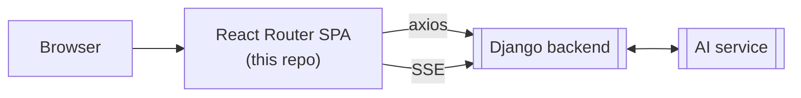

# NBE Financial Advisor — Frontend


An AI-powered personal finance app: connect bank accounts, upload and
reconcile bank statements, track spending and budgets, and get financial
guidance through a conversational assistant with interactive widgets
(spending breakdowns, savings projections, budget allocation sliders,
product recommendations). Fully bilingual — English and Arabic — with
complete RTL support.

This is the frontend of a three-service system built as a graduation
capstone project in partnership with the **National Bank of Egypt (NBE)**
innovation program: a React Router SPA (this repo), a Django backend, and a
LangGraph-based AI service.

[](https://github.com/john-roufaeil/nbe-financial-advisor-frontend/actions/workflows/ci.yml)




---

## Table of contents

1. [Features](#features)
2. [Quick start](#quick-start)
3. [Environment variables](#environment-variables)
4. [Scripts](#scripts)
5. [Project layout](#project-layout)
6. [Architecture at a glance](#architecture-at-a-glance)
7. [Authentication](#authentication)
8. [Internationalization](#internationalization)
9. [Styling rules](#styling-rules)
10. [Contributing](#contributing)
11. [Known limitations](#known-limitations)
12. [License](#license)

---

## Features

- **AI financial assistant** — a streaming chat interface (built on
  [assistant-ui](https://github.com/assistant-ui/assistant-ui)) that answers
  natural-language questions about the user's finances and renders its
  answers as interactive widgets: spending breakdowns, transaction lists,
  savings sliders, budget allocation sliders, and product recommendations.
- **Bank connections** — link real bank accounts, or upload bank statements
  (PDF/image, Arabic or English) for the AI service to extract, categorize,
  and reconcile against existing transactions.
- **Unified transactions ledger** — every account, manual or synced, in one
  place, with automatic categorization, recurring-charge detection, and
  anomaly flags for unusual spending.
- **Budgeting** — template-based budgets the user can customize, with KPIs,
  history, and spending-vs-budget insights.
- **Dashboard** — an at-a-glance view of balances, spending trends, and
  recent activity.
- **Admin panel** — a separate authenticated area for managing products,
  categories, user feedback, and reported issues (`super_admin`/`reviewer`
  roles only).
- **Full i18n + RTL** — every screen ships in English and Arabic from a
  shared key set, mirrored via `pnpm check:i18n` in CI.
- **Accessibility & display preferences** — font scale, high contrast,
  reduced motion, light/dark/system theme, and per-user number/date/time
  formatting.

## Quick start

The fastest way to run this app is the full stack via Docker — one command
brings up the frontend, the Django backend, the AI service, and every
supporting service (Postgres, Redis, object storage, mock bank) together.
Running the frontend alone against Node is the alternative for frontend-only
work with a backend already running elsewhere.

### Option A — Docker (recommended, full stack)

The compose files live in `nbe-financial-advisor-backend/deploy/`, not this
repo. Requires this repo and `nbe-financial-advisor-ai-service` checked out
as sibling directories next to `nbe-financial-advisor-backend`:

```bash
# 1. Copy .env.example → .env in this repo, ../nbe-financial-advisor-backend,
#    and ../nbe-financial-advisor-ai-service (all three are required)
cp .env.example .env

# 2. Bring up the whole stack (hot reload on backend/frontend/ai-service)
cd ../nbe-financial-advisor-backend/deploy
docker compose -f docker-compose.dev.yml up -d --build

# 3. Open http://localhost:5173
```

Full details — service list, `.env` files explained, prod compose, data
persistence — live in
[nbe-financial-advisor-backend/deploy/DOCKER.md](../nbe-financial-advisor-backend/deploy/DOCKER.md).

### Option B — Node only (frontend against an already-running backend)

```bash
# 1. Node 22 is required (pinned in Dockerfile.dev/.prod and CI)
nvm install 22 && nvm use 22

# 2. Enable the pinned package manager
corepack enable && corepack prepare pnpm@11.10.0 --activate

# 3. Install dependencies
pnpm install

# 4. Set the API base URL
cp .env.example .env.local
# Edit .env.local — set VITE_API_BASE_URL to your backend address

# 5. Start the dev server (http://localhost:5173)
pnpm dev
```

## Environment variables

| Variable            | Required | Description                                                  |
| ------------------- | :------: | ------------------------------------------------------------ |
| `VITE_API_BASE_URL` |    ✅    | Base URL of the Django backend, e.g. `http://localhost:8000` |

All data calls hit the real Django API — there is no mock/offline mode.

## Scripts

| Script              | What it does                                       |
| ------------------- | -------------------------------------------------- |
| `pnpm dev`          | Vite dev server with HMR                           |
| `pnpm build`        | Production bundle via React Router                 |
| `pnpm typecheck`    | Regenerates RR type stubs + runs `tsc`             |
| `pnpm lint`         | ESLint (zero warnings allowed)                     |
| `pnpm lint:fix`     | ESLint with auto-fix                               |
| `pnpm format`       | Prettier write                                     |
| `pnpm format:check` | Prettier check (CI)                                |
| `pnpm check:i18n`   | Verify locale key parity + all `t()` calls resolve |

**Pre-commit (Husky + lint-staged)** auto-runs lint + format on staged
`*.ts`/`*.tsx` files.

**Before opening a PR**, make sure these all pass locally — this mirrors what
CI runs:

```bash
pnpm lint && pnpm format:check && pnpm typecheck && pnpm build
pnpm check:i18n
bash scripts/check-no-hardcoded-hex.sh
```

## Project layout

```
app/
├── routes.ts        # Route registry — every page is registered here
├── routes/          # One file per page/layout guard
├── components/      # UI, grouped by domain + components/shared/
├── api/             # axios calls to the Django backend, one file per domain
├── queries/         # TanStack Query hooks — the ONLY import point for data
├── types/           # TypeScript interfaces + domain constants
├── store/           # Zustand stores — client-only UI/session state
├── lib/             # Utilities, custom hooks, lib/constants/
└── i18n/locales/    # en/ (source of truth) + ar/ (mirrors en/ key-for-key)
```

Two rules that hold everywhere in this codebase:

- **Never import `api/` directly in a component** — always go through
  `queries/`.
- **Never hardcode a magic value** (API path, route segment, `localStorage`
  key, duration, hex color) — it belongs in `lib/constants/`.

A deeper architecture reference — data flow, routing tree, auth/session
sequence diagrams, Zustand store inventory, the AI chat tool-call pipeline,
and a "where do I edit…?" table — lives in
[DOCUMENTATION.md](./DOCUMENTATION.md).

## Architecture at a glance

The frontend never talks to the AI service directly — every request,
including chat, goes through the Django backend at `VITE_API_BASE_URL`.
Real-time features (chat streaming, notifications) use Server-Sent Events,
not polling.

| Concern      | Library                            |
| ------------ | ---------------------------------- |
| Routing      | React Router v8 (SPA mode, no SSR) |
| UI           | DaisyUI v5 on Tailwind v4          |
| Server state | TanStack Query v5                  |
| Client state | Zustand v5                         |
| Forms        | React Hook Form + Zod              |
| i18n         | i18next + react-i18next            |
| HTTP         | axios                              |
| AI chat      | assistant-ui                       |
| Icons        | lucide-react                       |

See [DOCUMENTATION.md § 1–5](./DOCUMENTATION.md#1-tech-stack) for the full
breakdown and diagrams.

## Authentication

Access tokens are held **in memory only** — never written to `localStorage`.
On a page reload, the app silently calls `POST /auth/refresh` using the
httpOnly refresh cookie. If the cookie is missing or expired, the user sees a
"session expired" modal. Full sequence diagram in
[DOCUMENTATION.md § 6](./DOCUMENTATION.md#6-authentication--session-restore).

## Internationalization

Every screen ships in English and Arabic from 19 shared namespace files per
locale (`app/i18n/locales/{en,ar}/`), with full RTL mirroring via logical CSS
properties. `pnpm check:i18n` fails CI on any key drift between locales or
any `t()` call that doesn't resolve.

## Styling rules

- **DaisyUI semantic classes only** — never hardcoded hex colors (`#...`).
  CI enforces this via `scripts/check-no-hardcoded-hex.sh`.
- **Logical CSS properties** for RTL support: use `ms-`/`me-`/`ps-`/`pe-`
  instead of `ml-`/`mr-`/`pl-`/`pr-`.
- **One `btn-primary` per screen**. Use `badge-success`/`badge-error`/
  `badge-warning` for status.
- **Icons:** `lucide-react` with `size-*` + `text-*` classes.

## License

All rights reserved. This repository is shared publicly for
portfolio and demonstration purposes; no license is granted to use,
copy, modify, or distribute this code without explicit permission.
